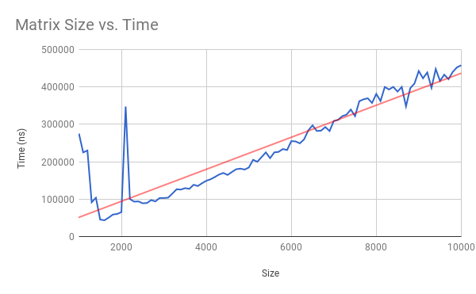

Team Beasts -- Tim Marder, William Lu, Max Millar

APCS2 pd2

L00 -- But What Does the Data Say?

2018-02-09 F

### Hypothesis:
The worst case runtime of MatrixFinder's Search() method increases at a linear rate with respect to the 1-dimensional size of the matrix.

### Background:
Class MatrixFinder's Search() method is an algorithm that theoretically has a O(n) runtime with input of n * n matrix.
We begin by defining two variables "rowCheck" and "colCheck" which will
hold the int index of the current row and column of the element that is
being looked at and compared to the target value. Those values will be
modified throughout the algorithm in order for the search method to go
through the correct elements in the correct order. Our algorithm starts
by comparing the target with the bottom left number in the 2D array. For
this to happen we set the rowCheck value to matrix.length - 1 so that the
element being looked at is in the very last row of the matrix and the
colCheck value is set to 0 so that the element being looked is in the very
first column of the matrix (resulting in the first element being looked
at to be the bottom left one). If the number is greater than the target,
the next spot compared will be 1 row up (by decreasing the rowCheck value
by 1). If the number is less, than the next spot will be 1 column to the
right (by increasing the colCheck value by 1). This continues using a while
loop until the target is found, or the target is not present, which in that
case you exit out of the while loop because of our conditional and the
algorithm returns (-1,-1).

### Experiment Methodology:
We created a method that populates a matrix according to the given rule:  increasing from up to down and left to right.
We tested matrices with size 1000 * 1000, 1100 * 1100 ... 10000 * 10000. The target is always the element on the upper right hand corner. For each size we made 10 trials and took the average.

### Results:

### Conclusions:
According to the graph, most of the data support our hypothesis that runtime increases at a linear rate with respect to the 1-dimensional size of the matrix. However, the runtime is significantly larger than what it should be when the size is less than 1500 and when the size is 2100. We cannot explain why this happens.
